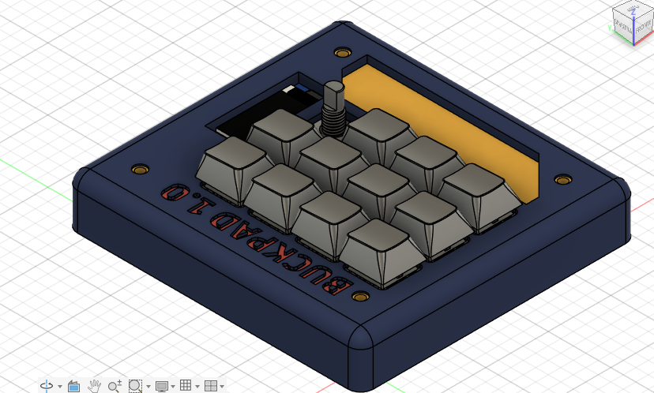
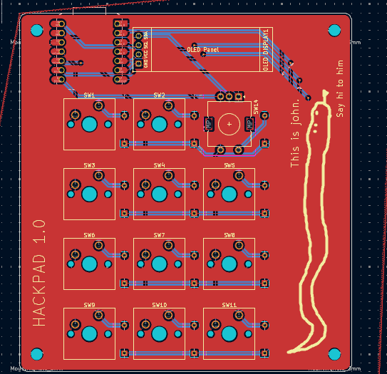
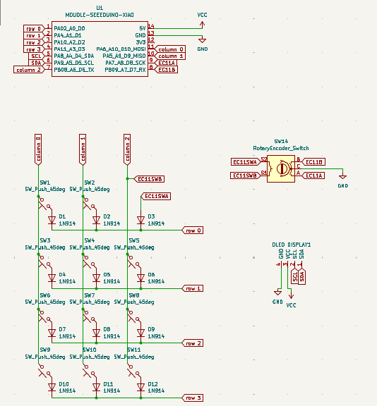
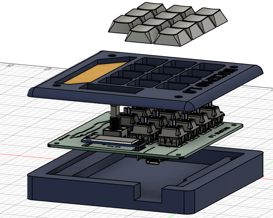

# BUCKPAD

hackpad for hackclub blueprint
The buckpad is a 11 key macropad with a rotary encoder and a OLED display, and uses QMK firmware.
The case is designed around the colors of gyspy danger from Pacific Rim, as it is one of the greatest films ever with NO sequel.
It mainly serves as a macropad for everyday activity (listening to music, writing etc.)

Features:
-11 keys
-1 EC11 rotary encoder
-1 Oled display

## PCB
here is the PCB (first time ever i do one!), the silkscreen is imported from a Figma image.

PCB design (I added a filling so its a bit messy, yikes)

Schematic for the hackpad

## Case Design
This was my first time working with Fusion and, not gonna lie, i had a ton of fun designing this case

## Firmware
This hackapd uses QMK firmware:
* the rotary encoder changes volume. press to mute
* the other 11 keys currently act as macros (thought i plan on implementing VIA to dynamically change them)
* I plan to set the oled as an audio visualizer once i get my hands on it.

## BOM

* 1x unsoldered Seeed XIAO RP2040
* 1x 0.91 inch OLED display
* 12x through-hole 1N4148 Diodes
* 11 MX-Style switches
* 1x EC11 Rotary encoder
* 11x white blank DSA keycaps
* 4x M3x16mm screws
* 4x M3x5mx4mm heatset inserts
* 1x Case (2 printed parts)